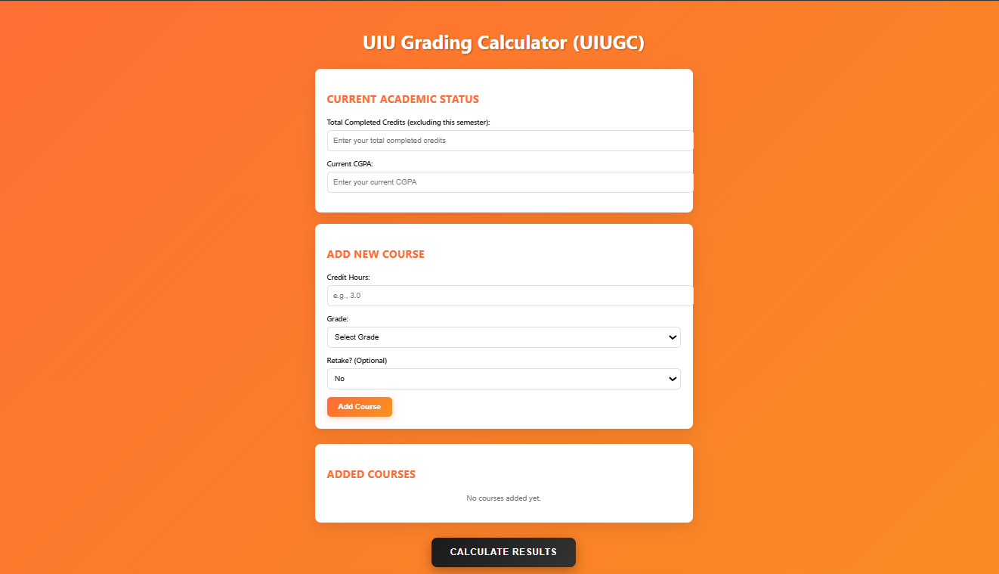

🎓 UIU Grading Calculator
A smart and intuitive grading system built for United International University (UIU) students. This browser-based tool helps you calculate your CGPA, GPA, and manage retake scenarios with precision and ease.

🚀 Features
✅ CGPA Calculator – Compute cumulative GPA based on all completed courses

📘 GPA Calculator – Calculate semester GPA with flexible inputs

🔁 Retake Logic – Automatically replaces previous grades in CGPA calculations

📊 Credit Tracking – Tracks total completed credits

💡 User-Friendly Interface – Clean, simple input for fast calculations

🧠 Retake Logic Explained
When you retake a course:

The new grade replaces the old one in CGPA calculation

Credits stay the same

CGPA is recalculated using the updated grade point

🌍 Live Demo
Try it now in your browser – no setup required:
👉 https://00sdn.github.io/UIU-grading-calculator

📦 How to Use
Open the site

Add your completed courses: course name, credit, and grade

Add current semester courses (including any retakes)

View your CGPA and GPA instantly with automatic updates

💡 Ideas to Extend
🌙 Dark mode support

🔔 GPA probation warning system

📥 Export or import course data (CSV/JSON)

📱 Mobile responsiveness improvements

📁 Technologies Used
HTML5, CSS3, JavaScript

(Optional backend): Python / Node.js

Hosting: GitHub Pages

🧑‍💻 Author
Made with 💙 by @00sdn

📜 License
MIT License – Free to use and customize
